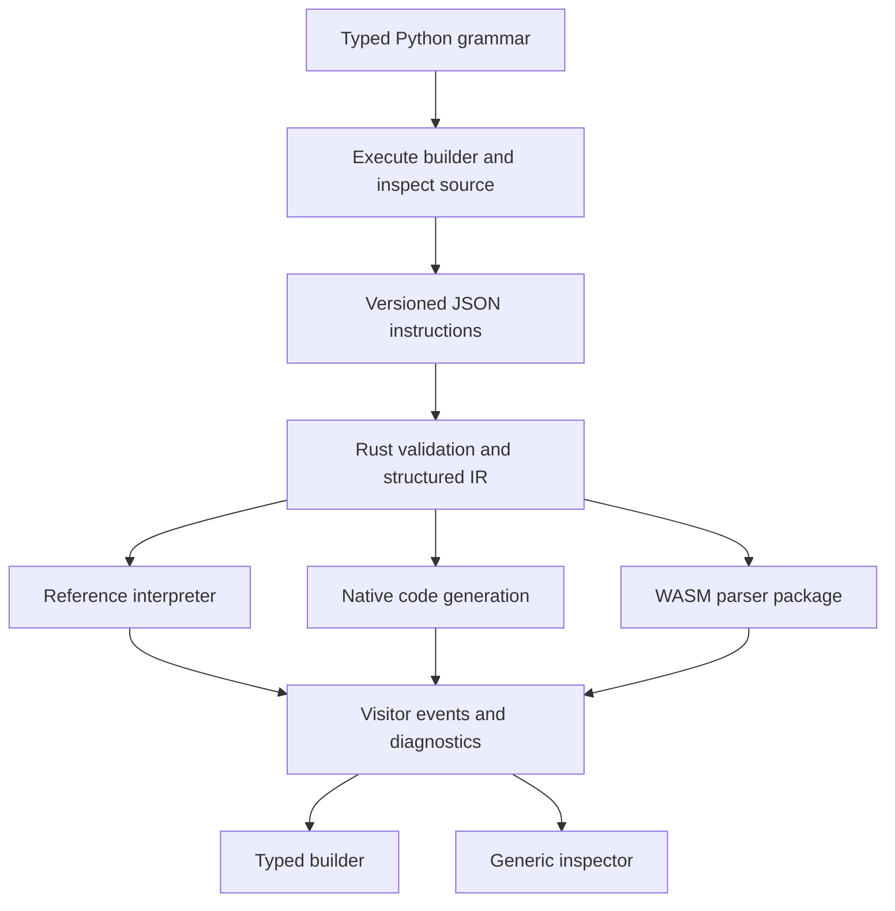

> [!summary]
> Build a binary parser generator with a fully typed Python authoring DSL that emits a portable JSON instruction stream, consumed by a compiler and reference interpreter preferably written in Rust. Generated parsers use a visitor core with source spans, optional typed representations, and explicit recovery boundaries. The eventual ecosystem includes native backends, WASM grammar packages, a registry, a VS Code binary inspector, corpus tests and fuzzing.

# Binary parser generator: implementation handover

This document synthesises a design discussion with Michael F. Bryan. It is self-contained: the implementing agent does not need the original conversation. No implementation exists as part of this handover. Code below specifies proposed authoring behaviour; imports and method names are illustrative, not an available package. The project has no agreed name.

**Status vocabulary:** “Required direction” captures Michael’s explicit requests. “Proposed default” is a concrete recommendation made during synthesis, which the implementing agent may refine with reasons. “Open” identifies a decision not settled in the discussion. Do not treat every illustrative API detail as an approved public contract.

Start with [[#2. Architecture and execution phases|the execution model]], use [[#5. Canonical typed examples|the examples]] to assess the authoring contract, and implement against [[#9. Testing and fuzzing contract|the acceptance cases]]. These links target sections within this document; no external notes are required.

**Handover verification:** all five Python code blocks were checked for valid Python syntax and the JSON example was parsed successfully. The proposed package does not exist here, so these examples have not been executed or type-checked against an implementation. Making them executable and statically checked is an implementation acceptance requirement.

## 1. Product intent and use cases

The initial idea was a binary counterpart to Tree-sitter: describe an existing binary format once, generate parsers for multiple languages, and use the same description in generic inspection tools. The useful analogy is the grammar ecosystem, common tooling interfaces, and first-class tests. Tree-sitter-style incremental reparsing is not an initial requirement.

Required direction:

- Author context-sensitive binary layouts: lengths derived from earlier fields, tagged payloads, conditional fields, repetition and nested bounded regions.
- Generate parsers targeting **Rust, Python, C, TypeScript and Go** over the project’s lifetime. A WASM wrapper alone does not fulfil the native-generation goal.
- Borrow the visitor/Serde-inspired separation from Michael’s `gcode` parser: parsing drives consumers; building a strongly typed AST is optional.
- Compile grammars to WASM for distribution through a registry and use in a VS Code extension that inspects files for which a grammar is available.
- Make unit testing, corpus fixtures and fuzzing first-class capabilities.
- Keep Python authoring fully typed and approachable with ordinary LSP completion.

Concrete uses include extracting selected telemetry fields without building a full tree, embedding a parser in an application or constrained device, validating interchange files, investigating damaged recordings, and exploring unfamiliar file formats through a hex view linked to decoded fields.

Michael’s [gcode documentation](https://docs.rs/gcode/latest/gcode/) describes a push-based, zero-allocation core, optional AST construction and retained source spans. Inspect its actual core and visitor interfaces before implementing this project; the discussion reviewed documentation, not a pinned source revision. Reuse the separation of responsibilities rather than assuming identical traits fit binary data.

Existing work matters. [Kaitai Struct](https://kaitai.io/) already provides declarative binary formats, multiple language targets and inspection tools; [ImHex’s Pattern Language](https://docs.werwolv.net/pattern-language) provides a programmable binary-inspection DSL; [EverParse](https://project-everest.github.io/) explores verified native parsers. The intended distinction is the combination of Python authoring, an embeddable visitor core, portable compiler input, and a common inspection contract. Do not claim dependent lengths or tagged dispatch are novel.

## 2. Architecture and execution phases

The central rule is:

**Python builds the grammar. Decoder operations describe what happens when parsing.**



Three phases must stay separate:

1. **Construction:** Python runs with symbolic decoder results and emits grammar instructions. Ordinary imports, helpers and static configuration are available here.
2. **Compilation:** Rust validates the portable description, reconstructs structured regions, checks dependencies and prepares execution or generated code.
3. **Parsing:** The interpreter or generated parser consumes binary input. It does not run grammar-author Python code.

There are also two different event interfaces:

| Interface | Example | Consumer |
| --- | --- | --- |
| Grammar instruction stream | Read a little-endian u16 and bind `v1` | Compiler |
| Runtime visitor events | Field `length` has value 12 at source bytes `[1, 3)` | Application, AST builder, inspector |

The instruction stream contains control flow and references. Runtime events contain actual values, locations and outcomes. They must not be conflated.

## 3. Typed Python authoring model

### Values, spans and naming

`Expr[T]` is a symbolic computation producing a value of Python type `T` when parsing. It is not the parsed value. The IR must retain wire widths, signedness and byte order even when several reads return `Expr[int]`.

`ByteSpan` is a symbolic reference to a source-backed region. It must preserve source identity and position and should not inherently copy bytes. `Expr[bytes]` is a byte-valued expression suitable for dispatch and comparisons. Exact storage and borrowing policies remain runtime-specific.

Proposed surface:

| Operation | Type/meaning |
| --- | --- |
| `u8(name)`, `u16(name)`, `u32(name)` | `Expr[int]`; wider reads use the active endian default |
| `u16le(name)`, `u32be(name)` | `Expr[int]`; explicit override |
| `bytes(name, length=...)` | `Expr[bytes]` |
| `take(name, length=...)` | `ByteSpan`; consume the parent region and retain its source range |
| `string(name, length=..., encoding=...)` | `Expr[str]` |
| `cstring(name, encoding=...)` | `Expr[str]`; consume a terminator or fail within the current region |
| `remaining` | `Expr[int]`; bytes left in the current bounded decoder |
| `expect_bytes(name, literal)` | Record a literal read/check; returns `None` |
| `require_end()` | Record a zero-remaining check; returns `None` |
| `condition(predicate)` / `otherwise()` | Context managers recording alternative regions |
| `range(count)` | `Iterator[Expr[int]]`; symbolic counted repetition |
| `until_eof()` | `Iterator[Expr[int]]`; symbolic repetition to region end |
| `record(name, index=...)` | Context manager yielding a scoped `Decoder` |
| `records(name, count=...)` | Proposed convenience returning `Iterator[Decoder]` |
| `checkpoint(span)` | Context manager yielding a bounded child `Decoder` |
| `choice(discriminator, cases, default=...)` | Record tagged dispatch; returns `None` |

Lengths accept typed integer literals or `Expr[int]`; validate negatives and bounds. All parser functions have a typed `Decoder` parameter and normally return `None`. Fields are defined by decoder operations, not by returning dictionaries.

Use typed methods and inferred local types. Unused reads need not bind a variable; `for` targets and `with ... as` bindings can be inferred from annotated API returns. “Fully typed” does not mean predeclaring every local variable. Do not use `Any` to hide unsupported symbolic behaviour.

### Arithmetic and comparisons

Operator overloads build expression nodes, including reflected operators where useful. For example, `length * 4 + 8` builds a dependency expression. Ordinary Python `if`, `while`, `and`, `or`, chained comparisons and `not` can trigger truth conversion; symbolic `__bool__()` should reject that with a diagnostic.

Python typing has a specific trap: `object.__eq__()` returns `bool`, which complicates a type-correct override returning `Expr[bool]`. **Open:** decide and type-check comparison APIs early. A proposed escape is explicit `expr.eq(literal)` and `expr.ne(literal)` for symbolic equality, while `choice()` covers common discriminant comparisons. Do not present an API as fully typed unless it passes the chosen checker without suppressions that erase the contract.

Define expression integer semantics before adding backends. Width/overflow, signed arithmetic, division, shifts, mixed types, and bounds conversions must agree across Python, Rust, C, Go and TypeScript. The JSON encoding must also preserve integers beyond JavaScript’s exact-number range. These were not settled; checked arithmetic with explicit conversions is a proposed starting point, not a prior decision.

### Endianness decorators

Required direction: mark endianness using decorators, so common reads are `d.u16()` rather than repeated `d.u16le()`.

Proposed semantics:

- `@little_endian` and `@big_endian` establish a scoped default for a grammar function.
- Undecorated helpers inherit the active default; decorated helpers override it temporarily.
- The caller’s default is restored on every exit, including exceptions.
- Explicit endian reads remain available for mixed-endian formats.
- Preserve Python signatures for type checking and completion.
- Emit resolved byte order on primitive reads, or otherwise preserve equivalent explicit semantics in IR.
- Reject multi-byte reads lacking a default rather than using host endianness.

Named compiled rules may need specialisation by inherited endianness. Inlining or specialisation can be chosen initially; do not accidentally make a helper’s semantics depend on which caller happened to compile it first.

### Structured conditionals

```python
from binary_grammar import Decoder, Expr, little_endian


@little_endian
def conditional_fields(d: Decoder) -> None:
    version: Expr[int] = d.u8("version")

    with d.condition(version > 2):
        d.u32("extended_flags")

    with d.otherwise():
        d.u8("legacy_flags")
```

Both Python bodies execute during construction; each records a separate branch. Only the selected branch executes while parsing. Context managers manage the builder’s region stack. Proposed rule: `otherwise()` attaches to the immediately preceding conditional in the same enclosing region, with no intervening emitted decoder operation, and cannot attach twice.

Python assignment is not a runtime merge. Assigning `length` in both bodies leaves the Python name referring to the later assignment. IR validation must reject its use outside its defining branch. For the first implementation, repeat dependent reads inside each alternative. Explicit branch results/phi values remain future work.

Ordinary `if` on a concrete build-time boolean is valid configuration and must remain supported. AST linting should not ban every Python conditional.

### Symbolic loops

Required direction: exploit iterator exhaustion to delimit the body of `for i in d.range(count)`.

1. On first `__next__()`, open the repeat region and yield a symbolic index.
2. Python executes the body once, recording operations.
3. On second `__next__()`, close the region and raise `StopIteration`.
4. At parse time the recorded region executes as many times as required, with fresh per-iteration bindings.

The builder executes once even when the runtime count is zero. A compiled collection must still exist as an empty collection in that case; infer its declaration structurally rather than relying solely on the first runtime record event.

Built-in `range(expr)` requests a concrete integer through `__index__()`; it does not call the expression’s iterator. Use `d.range()` explicitly.

Restrictions:

- Python list mutation runs once; it does not build runtime arrays.
- Python accumulators do not become loop-carried runtime variables.
- A symbolic index or field cannot escape the iteration scope without an explicit result mechanism.
- `break`, escaping `return`, and exceptions bypass the normal exhaustion hook. Reject supported recognisable misuse, abort construction on exceptions, and check for unclosed regions.
- Do not depend on garbage collection or generator finalisation to close regions.
- `continue` has subtler behaviour; do not promise general support before specifying it.
- EOF repetition needs runtime progress checks and work limits. Reaching EOF between records succeeds; reaching it inside a required field is truncation.

`d.records()` was proposed for ergonomics; it is not a replacement for the explicitly requested `d.range()` primitive. When no count is provided, the examples assume repetition to the current region’s end. Live streams require a separate “need more input” contract or an actual boundary; buffer exhaustion is not automatically final EOF.

## 4. Payload dispatch and checkpoint recovery

### Choice

Required direction: `choice()` takes a symbolic discriminator and a dictionary mapping concrete expression literals to parsing functions. It does not enumerate paths by re-running the whole grammar.

Handlers are `Callable[[Decoder], None]`. During construction, each handler is invoked into an isolated IR alternative with the same starting decoder context. During parsing, only the selected handler runs. A default handler can preserve unknown bytes. Support byte and integer discriminators with precise typing; reject mismatched literal types and duplicate keys in serialised IR.

For JSON, represent byte keys with a tagged encoding such as hex, and alternatives as an array of tagged values plus bodies/rule references. JSON object keys cannot directly express arbitrary typed bytes or integers without losing information.

### Checkpoint semantics

Required direction: `with decoder.checkpoint(some_span) as child:` interprets a bounded span, retains partial results on failure, and allows the enclosing stream to continue.

Proposed operational contract:

1. `take()` establishes an entirely available, in-bounds span and advances the parent past it. A failed `take()` does not invent a partial boundary.
2. The checkpoint opens a child cursor at the span start, restricted to that source range.
3. Child reads cannot consume a following chunk, padding or trailer.
4. Successful reads retain absolute source locations.
5. A recoverable parse failure exits to the nearest active checkpoint, retaining the decoded prefix and failure diagnostic. Execution resumes after that checkpoint in the parent.
6. A successful child that leaves bytes unconsumed must expose those bytes as uninterpreted; `require_end()` can turn that situation into a validation failure.
7. A checkpoint is not a rollback of the parent cursor, and not an alternative-parser/backtracking primitive.

The Python `with` constructs an IR recovery region. It does not catch future runtime parsing errors in Python. Host bugs, compiler errors, cancellation and resource exhaustion must not be silently converted into ordinary recoverable payload errors; define separate failure categories.

Recommended inspection representation separates **coverage** (complete, partial, opaque) from **validity** (valid, invalid, unchecked). A fully consumed payload can fail validation; an opaque unknown payload is not necessarily malformed. This refines the earlier shorthand “complete/partial/opaque”.

A corrupt length cannot be repaired by this mechanism. Out-of-bounds lengths fail before a child checkpoint exists. An incorrect but in-bounds length can still select a wrong next boundary. Recovery follows declared structure, not guessed resynchronisation.

Nested checkpoint outcomes must propagate aggregate incompleteness/diagnostics to enclosing results even when their own cursor reaches the end successfully. A strict application must not receive a clean success simply because errors were locally recovered.

## 5. Canonical typed examples

These examples use the proposed `binary_grammar` surface above. A typed API may infer context-manager and iterator targets; all function boundaries and stored symbolic dependencies are annotated. The snippets in this section share imports and definitions and can be assembled into one module.

### Type-length-data packet

Wire format: `u8 type`, `u16 little-endian payload length`, then exactly that many payload bytes. Length excludes the header.

```python
from typing import Callable, Mapping, TypeAlias

from binary_grammar import (
    ByteSpan,
    Decoder,
    Expr,
    big_endian,
    little_endian,
)

Parser: TypeAlias = Callable[[Decoder], None]


@little_endian
def tld_packet(d: Decoder) -> None:
    d.u8("type")
    length: Expr[int] = d.u16("length")
    d.take("data", length=length)


@little_endian
def counted_packets(d: Decoder) -> None:
    count: Expr[int] = d.u16("count")

    for i in d.range(count):
        with d.record("packets", index=i) as entry:
            tld_packet(entry)


@little_endian
def packets_to_end(d: Decoder) -> None:
    for i in d.until_eof():
        with d.record("packets", index=i) as entry:
            tld_packet(entry)
```

Example input for `counted_packets`: `02 00 01 03 00 AA BB CC 02 02 00 DD EE`. Expected count is 2; packet types are 1 and 2; payload lengths are 3 and 2. Payload ranges are `[5, 8)` and `[11, 13)`. The second packet reads its own length, not a reused first-iteration value.

An optional owned application representation could be:

```python
from dataclasses import dataclass


@dataclass(frozen=True)
class Packet:
    type: int
    length: int
    data: bytes


@dataclass(frozen=True)
class CountedPackets:
    count: int
    packets: list[Packet]
```

The builder chooses to materialise spans as owned bytes here. The core must not require that choice.

### PNG structural inspection

The [PNG chunk structure](https://www.w3.org/TR/PNG-Structure.html) consists of a length, four-byte type, payload, and CRC after an initial signature. Payload lengths exclude the framing. The following handlers decode the image-header layout and Latin-1 text chunks described in the [PNG specification](https://www.w3.org/TR/png-3/).

```python
def opaque(d: Decoder) -> None:
    d.take("uninterpreted", length=d.remaining)


@big_endian
def png_header(d: Decoder) -> None:
    d.u32("width")
    d.u32("height")
    d.u8("bit_depth")
    d.u8("colour_type")
    d.u8("compression_method")
    d.u8("filter_method")
    d.u8("interlace_method")
    d.require_end()


def png_text(d: Decoder) -> None:
    d.cstring("keyword", encoding="latin-1")
    d.string("text", length=d.remaining, encoding="latin-1")


def png_end(d: Decoder) -> None:
    d.require_end()


PNG_CHUNKS: Mapping[bytes, Parser] = {
    b"IHDR": png_header,
    b"tEXt": png_text,
    b"IEND": png_end,
}


@big_endian
def png_chunk(d: Decoder) -> None:
    length: Expr[int] = d.u32("length")
    kind: Expr[bytes] = d.bytes("type", length=4)
    payload: ByteSpan = d.take("payload", length=length)

    with d.checkpoint(payload) as body:
        body.choice(kind, PNG_CHUNKS, default=opaque)

    d.u32("crc")


@big_endian
def png(d: Decoder) -> None:
    d.expect_bytes("signature", b"\x89PNG\r\n\x1a\n")

    for chunk in d.records("chunks"):
        png_chunk(chunk)
```

This is an intentionally incomplete structural inspector: CRC is read but unchecked, image data is opaque, ordering and field constraints are not enforced, and scanning runs to region EOF rather than stopping at `IEND`. Do not advertise PNG conformance. IDAT payloads collectively form a compressed stream; do not later assume each chunk is independently decompressible.

A short `IHDR` payload can retain width and height, fail on a later field, and still let the parent read the CRC and subsequent chunks. A missing text terminator is contained within the text payload. Unknown types use the opaque fallback; rendering-policy requirements for unknown critical chunks belong in a fuller validator.

### RIFF/WAVE structural inspection

[RIFF](https://learn.microsoft.com/en-us/windows/win32/xaudio2/resource-interchange-file-format--riff-) supplies an enclosing size and per-chunk sizes, with padding after odd-sized payloads excluded from those sizes. This example covers a WAVE container and the common format prefix/optional extension in [WAVEFORMATEX](https://learn.microsoft.com/en-us/windows/win32/api/mmeapi/ns-mmeapi-waveformatex).

```python
@little_endian
def wave_format(d: Decoder) -> None:
    d.u16("format_tag")
    d.u16("channels")
    d.u32("samples_per_second")
    d.u32("average_bytes_per_second")
    d.u16("block_align")
    d.u16("bits_per_sample")

    with d.condition(d.remaining > 0):
        extension_size: Expr[int] = d.u16("extension_size")
        d.take("extension", length=extension_size)

    d.require_end()


def wave_samples(d: Decoder) -> None:
    d.take("samples", length=d.remaining)


WAVE_CHUNKS: Mapping[bytes, Parser] = {
    b"fmt ": wave_format,
    b"data": wave_samples,
}


@little_endian
def wave_chunk(d: Decoder) -> None:
    kind: Expr[bytes] = d.bytes("type", length=4)
    size: Expr[int] = d.u32("size")
    payload: ByteSpan = d.take("payload", length=size)

    with d.checkpoint(payload) as body:
        body.choice(kind, WAVE_CHUNKS, default=opaque)

    d.take("padding", length=size % 2)


@little_endian
def wave_contents(d: Decoder) -> None:
    d.expect_bytes("form_type", b"WAVE")

    for chunk in d.records("chunks"):
        wave_chunk(chunk)


@little_endian
def wave(d: Decoder) -> None:
    d.expect_bytes("signature", b"RIFF")
    size: Expr[int] = d.u32("size")
    contents: ByteSpan = d.take("contents", length=size)

    with d.checkpoint(contents) as body:
        wave_contents(body)

    d.take("padding", length=size % 2)
    d.require_end()
```

Padding belongs to the parent, outside the payload checkpoint. An invalid `fmt ` body can therefore fail without moving the next chunk boundary. A child length extending beyond the RIFF region fails to the enclosing checkpoint instead. An unavailable outer RIFF span fails before that outer checkpoint opens.

The example accepts the basic 16-byte PCM prefix and size-prefixed extensions, but does not validate codec-specific constraints, enforce chunk presence/order, decode samples, or cover all WAVE variants. Cross-chunk dependencies are deliberately unresolved: decoding `data` into samples requires a valid earlier `fmt ` interpretation. Do not implement that by mutating a Python global during construction.

## 6. Portable JSON and Rust compiler

Required direction: the Python library emits a stream of operations such as “read u8”, “enter checkpoint”, and “exit loop”, serialised as JSON for another-language compiler, probably Rust.

A flat stream is convenient for construction. Proposed Rust internals use a structured typed IR reconstructed from balanced region markers. Use scoped value IDs before introducing more elaborate SSA machinery.

Illustrative serialisation, not a final schema:

```json
{
  "ir_version": 1,
  "entry": "packet",
  "rules": {
    "packet": [
      {"op": "read", "field": "type", "type": "u8", "result": "v0"},
      {"op": "read", "field": "length", "type": "u16", "endian": "little", "result": "v1"},
      {"op": "take", "field": "payload", "length": {"ref": "v1"}, "result": "s0"},
      {"op": "enter_checkpoint", "span": "s0"},
      {"op": "read", "field": "value", "type": "u32", "endian": "little", "result": "v2"},
      {"op": "require_end"},
      {"op": "exit_checkpoint"}
    ]
  }
}
```

The final format needs:

- A versioned envelope, entrypoint, rule identities and explicit literal encodings.
- Stable IDs and types for expression results, spans, loop indices and regions.
- Expression nodes for literals, references, arithmetic and predicates.
- Reads, literal checks, byte spans, records/collections, repetitions, branches, choices and checkpoints.
- Source locations connecting instructions to Python file, line and column, with helper/call context where feasible.
- Metadata for field names, documentation and eventual inspection schemas.
- Deterministic output for the same grammar/configuration; avoid object identities and incidental addresses.

Validate the JSON independently of Python: other frontends or arbitrary inputs may produce it. Reject malformed nesting, unresolved or wrongly typed references, scope escape, unsupported operations, ambiguous fields and incompatible alternatives. Account for field names repeated as array entries or mutually exclusive alternatives; do not simply reject every repeated string.

Optimisations must preserve observable field events, source spans, diagnostics and recovery outcomes. Ignoring a field in a visitor does not remove a parser-internal dependency on it. A full linear-time claim is inappropriate until offset access, recursion, loops and resource semantics are constrained.

## 7. Runtime, visitor and typed representations

The parser owns interpreting the format, cursor state and values needed for dependencies. The visitor owns what to retain or do with observations. Consumers should include a validator, selective extractor, owned typed builder, and generic inspector.

Proposed runtime events include record/collection boundaries, field values and source ranges, opaque regions, diagnostics, and region outcomes. Their exact enum/trait design is open. Ensure record boundaries close coherently on failure and that consumers can distinguish absent fields from failed reads.

An AST builder must not publish a complete typed record from a failed region. It may discard provisional values, return a typed partial result, or retain a separate inspection representation. Visitor side effects cannot generally be rolled back; document provisional events and support buffering at the consumer where required.

Source locations should ultimately accommodate bits and multiple sources: source ID plus half-open bit range is a proposed model. Initial byte-only support is reasonable. Transformed/decompressed data should have a derived source with provenance rather than a fictitious contiguous offset in the original file. Arbitrary offsets may form a graph rather than a tree.

Zero-copy and zero-allocation are design aspirations for suitable generated core paths, not promises for Python objects, generic trees, reference interpreters, decompression or WASM boundary transfers. Keep the core separable from allocation-heavy conveniences and document memory requirements. Grammar state still requires storage for values used by later reads.

The initial assumption that machine-produced data rarely needs malformed-input handling was revised. Human-style syntax recovery can be deferred; truncation, corrupt fields, incompatible versions and bounded recovery are core use cases.

## 8. Diagnostics and Python approachability

Required direction: use Python source/AST inspection, or potentially function decompilation, for lints and source-level diagnostics. AST analysis supplements symbolic execution; it need not compile all Python.

Proposed default: inspect available source with `ast`, keep original function/source metadata through decorators, and run checks during grammar compilation. Prefer source to bytecode decompilation; decompilation is a fallback research direction, not required scope. If source is unavailable, retain runtime/IR validation and state reduced lint coverage.

| Failure | Detection |
| --- | --- |
| Symbolic expression in Python truth context | `Expr.__bool__()` plus source diagnostic |
| `break`/escaping return from recognised symbolic loop | AST lint and unclosed-region checks |
| Ordinary list mutation in a symbolic loop | AST warning where recognisable |
| Branch/loop-local value used outside its scope | IR validation |
| Wrong type passed to a DSL method | Python checker and IR validation |
| Runtime out-of-bounds read | Structured parse diagnostic |

Aliases, helpers, nested ordinary loops and dynamic Python constructs make perfect static detection unrealistic. A `break` in a nested ordinary loop does not exit the outer symbolic loop. Lints should distinguish definite errors from suspicion. Do not claim an ordinary LSP can enforce all staging rules.

Type-check the actual public examples, including decorators, operator overloads, mapping dispatch and inferred decoder bindings. Preserve signature help and document the build-time/runtime distinction in completion docs. `bytes()` versus `take()` and checkpoint non-rollback semantics need particularly clear descriptions.

## 9. Testing and fuzzing contract

Required direction: first-class unit tests, binary corpus fixtures and fuzzing, inspired by the workflow of grammar ecosystems such as Tree-sitter. The exact corpus file format and CLI names remain open.

Run corpus tests against compiled IR through the Rust reference interpreter. A second Python “real decoder” implementation is not the authoritative test oracle; it could disagree with generated semantics.

Each fixture should express input, entry rule, parse policy, expected field values and ranges, diagnostics, aggregate status and final cursor. Normalise backend results into a comparable representation, including byte and large-integer encoding. Keep snapshots focused enough to review; add direct assertions for important invariants.

Minimum acceptance cases:

| Area | Behaviour to verify |
| --- | --- |
| TLD | Zero-length payload, one packet, multiple differing lengths, exact source ranges |
| Arrays | Zero count yields an empty collection; fresh bindings per iteration |
| EOF | Success at record boundary; truncation inside a header/payload |
| Choice | Known alternatives, opaque default, matching literal types |
| Conditional | Both branches constructed but only selected branch parsed |
| Endianness | Nested override and restoration, mixed-endian reads, no host default |
| Checkpoint | Short child read retains prefix and resumes at correct parent position |
| Checkpoint | Successful read with trailing bytes; explicit `require_end` failure |
| Nested recovery | Oversized child span exits to outer checkpoint; unavailable outer span is fatal |
| Padding | Odd RIFF payload followed by another chunk preserves alignment |
| Diagnostics | Symbolic truth misuse and branch/loop scope escape rejected clearly |
| Termination | EOF loop with no cursor progress fails within a bounded work budget |
| IR | Invalid IDs, wrong types and unbalanced markers rejected without panics |
| Policy | Recovered errors remain visible to strict callers and parent outcomes |

Three fuzzing targets:

1. **Binary input fuzzing:** arbitrary bytes and mutations under fixed grammars. Check termination/resource limits, valid spans, no panics, and structured failures.
2. **IR/compiler fuzzing:** malformed JSON and well-formed-but-invalid typed structures; check safe rejection and bounded compilation.
3. **Differential backend fuzzing:** compare interpreter and generated parsers for normalised values, spans, cursor positions and error/recovery outcomes.

Preserve minimised regressions as corpus fixtures. Grammar-guided valid-input generation and round-trip serialisers are useful future work, not prerequisites for mutation fuzzing. Arbitrary predicates, checksums and dependent lengths make general valid generation nontrivial.

## 10. WASM, registry and VS Code use

Required eventual direction: publish compiled grammars and inspect supported binary formats in VS Code.

A registry package should eventually contain grammar source, versioned IR or equivalent metadata, a compiled WASM module, compatibility information and test fixtures. Exact registry protocol, signing policy, format detection and packaging remain open.

The inspector needs a stable reflective interface: field identity, types, docs, values, source spans, child enumeration and diagnostics. A language-specific AST alone is insufficient. Native applications can use typed APIs while tooling uses this common representation.

Important later constraints:

- Large files need bounded reads and eventually lazy/paged child enumeration; avoid eagerly allocating millions of nodes.
- Batch WASM/host events rather than assuming one host callback per scalar is affordable.
- A WASM sandbox still needs memory and instruction/work limits.
- Python grammar construction executes Python and is a distinct trust boundary from running a compiled grammar. Do not make an inspector execute downloaded grammar Python implicitly.
- Bitfields, offset references, compression and derived sources complicate highlighting and should remain explicit capabilities.
- Grammar versioning and an ABI version are needed before distributing compiled modules.

Incremental reparsing is deferred. Editing a length or offset can invalidate distant regions, so ordinary text-parser locality assumptions do not hold automatically.

## 11. Design history: preserve intent without reviving discarded complexity

| Earlier idea | Current disposition |
| --- | --- |
| Standalone binary grammar DSL | Python builder is the desired initial frontend |
| Replay the function with `__bool__()` choosing false/true | Superseded for normal control flow by explicit context managers and `choice()` |
| Built-in `range(expr)` | Use `d.range()` because Python requires a concrete index |
| Symbolic iterator with one representative body | Retained; reject unsupported escaping control flow |
| AST transformation into a Python-subset compiler | Possible future option; AST lints are the current diagnostic direction |
| Every read has an explicitly annotated local variable | Fully typed API plus inferred locals; unused bindings are unnecessary |
| Endian suffix on every read | Decorator defaults, explicit suffixes for exceptions |
| Native generation immediately | Eventual requirement; reference interpreter first is a proposed delivery sequence |
| Binary input can be assumed valid | Bounded errors and inspection of damaged input are part of the design |

## 12. Open decisions and proposed delivery sequence

The implementing agent should resolve routine choices and record them rather than blocking on every name. Bring back decisions that materially change the authoring model, portability or recovery guarantees.

| Decision | Proposed starting point |
| --- | --- |
| Project/package names and supported Python baseline | Choose explicitly before publishing code |
| IR schema and scalar arithmetic | Version 1, scoped IDs, explicit encodings and checked bounds; settle overflow semantics before backend work |
| Input model | Bounded random-access byte source first; resumable streaming later |
| Checkpoint policy | Inspection recovery with aggregate diagnostics; strict caller mode must reject recovered failures |
| AST optionality and branch outputs | Preserve partial data separately; no implicit phi values |
| Helper compilation | Inlining or specialised named rules; retain source/call context |
| Collection declaration | Explicit structural collection metadata, including zero iterations |
| Symbolic equality typing | Type-checked explicit methods if operator overloading conflicts with Python typing |
| Span coverage versus validity | Separate properties rather than one overloaded status |
| Recursion and arbitrary offsets | Defer or tightly bound until semantics are specified |
| Cross-record state | Explicit future runtime bindings; never Python mutation as a substitute |
| Complete PNG/WAVE support | Examples first; full format validation is a separate milestone |

Recommended milestones, not a claim that Michael mandated this exact order:

1. **Executable semantics:** typed Python builder, deterministic JSON, Rust loader/validator/reference interpreter, TLD examples and recovery corpus. Choose coherent integer and source-span semantics.
2. **Authoring and real formats:** decorators, conditions, choice, symbolic loops/records, checkpoint nesting, PNG/WAVE structural examples, type-checking and AST diagnostics. Some of these naturally overlap milestone 1; do not ship a first demo that misrepresents core semantics.
3. **First native backend:** Rust visitor-based generated parser, optional owned builder, and differential tests against the interpreter. Add a second native language to expose portability issues early.
4. **WASM inspection proof:** stable provisional inspection interface, host integration, resource limits and a minimal file inspector.
5. **Broader product:** remaining native targets, richer format features, registry, VS Code UX and large-file capabilities.

The first usable implementation must demonstrate construction, serialisation, parsing and observable recovery end to end. It must not stop at mocked API scaffolding or JSON snapshots with no parser execution.

## 13. Instructions to the implementing agent

Use this handover as the project brief. Inspect any provided repository and its local instructions before changing code. Review Michael’s `gcode` core for concrete visitor-design inspiration. Preserve the typed Python → portable IR → Rust compilation boundary.

Start with the smallest complete path through that architecture, maintain meaningful behavioural tests, and keep the public grammar examples running and type-checked. Make diagnostic and recovery behaviour observable from the start. Record material deviations from this document and explain why they improve correctness or authoring ergonomics.

Do not silently substitute ordinary Python execution at parse time, assume malformed data is impossible, add branch replay back as a prerequisite, or claim that an interpreter/WASM wrapper fulfils all native-generation goals. Do not implement the registry and editor before the parsing contract is stable.

Deliver runnable code, documented build/test commands, a small fixture corpus, and an honest account of supported features and limitations. Keep the implementation concrete: typed boundaries, small coherent modules, explicit errors, source provenance and tests of real parsing behaviour.
